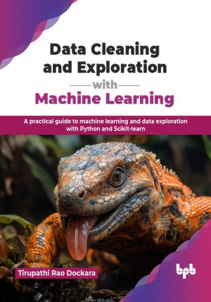

# Data Cleaning and Exploration with Machine Learning

A practical guide to machine learning and data exploration with Python and Scikit-learn.

This is the repository for [Data Cleaning and Exploration with Machine Learning
](https://bpbonline.com/products/data-cleaning-and-exploration-with-machine-learning?variant=44865575715016),published by BPB Publications.

## About the Book
Machine learning has become central to how organizations handle data in today’s world. With businesses generating vast amounts of information, the ability to clean, explore, and model data effectively is no longer optional, it is a critical skill for decision-making, innovation, and competitive advantage.

This book takes readers on a structured journey, starting with Python foundations and essential libraries. It discusses data cleaning, preprocessing, and exploratory analysis, and then explores text and time series data, dimensionality reduction, regression, classification, and clustering techniques. Advanced topics such as model evaluation, neural networks, deep learning, retrieval-augmented generation, and explainable AI are covered in detail, which are supported by real-world examples and case studies. Each chapter builds progressively, ensuring both theoretical grounding and practical application, and vital industry practices.

By the end of the book, readers will be equipped with the skills to handle raw datasets, uncover patterns, build and evaluate ML models, and apply advanced techniques responsibly. You will be confident in applying these methods to solve problems in their domains, making yourself a competent data practitioner, ready to deliver insights and drive impact.

## What You Will Learn
• Understand Python foundations and essential data science libraries.

• Apply data cleaning methods to handle missing or noisy data.

• Perform exploratory data analysis using statistics and visualization.

• Work with text, time-series, and high-dimensional datasets.

• Build regression, classification, and clustering ML models.

• Evaluate models with metrics, validation, and hyperparameter tuning.

• Explore neural networks, deep learning, and explainable AI techniques.

• Implement real-world case studies and capstone data projects.
